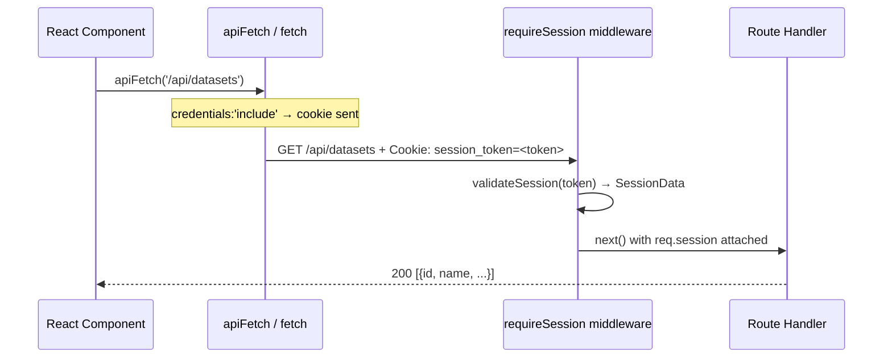
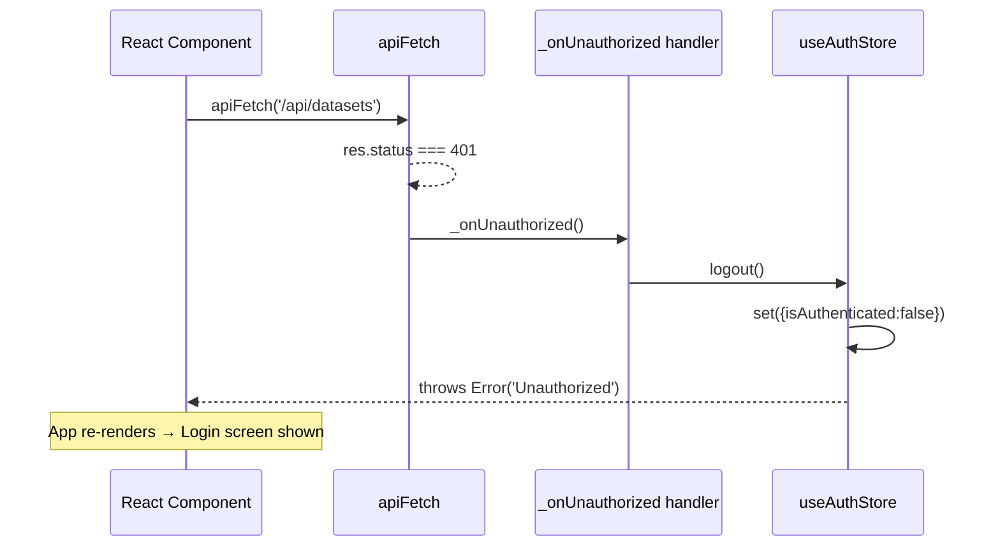

# Design Document: Railway Production Auth Fix

## Overview

The deployed Railway app is broken in production: every request to a protected API route returns 401 Unauthorized because the session cookie is silently dropped by the browser on HTTPS redirects and Railway's reverse-proxy hops. The root cause is `sameSite: 'strict'` on the `session_token` cookie — strict-mode cookies are not sent on cross-site navigations or after a redirect chain, which is exactly what Railway's HTTPS termination proxy introduces. A secondary issue is that a handful of raw `fetch()` calls in the frontend are missing `credentials: 'include'`, so even with the cookie fixed those calls would still fail in production.

This fix is intentionally minimal: change one cookie attribute, add `credentials: 'include'` to the two raw `fetch` calls that are missing it, and document the required Railway environment variables. No refactoring, no new features, no changes to local dev behaviour.

---

## Architecture

The app is a single-origin deployment on Railway. Express serves both the Vite-built SPA and the `/api/*` routes from the same process. Auth is entirely cookie-based — no Bearer tokens.

```mermaid
graph TD
    Browser -->|HTTPS| Railway_Proxy[Railway Reverse Proxy / TLS Termination]
    Railway_Proxy -->|HTTP| Express[Express Server :PORT]
    Express -->|Set-Cookie: session_token| Browser
    Express -->|Static files| Browser
    Express -->|requireSession middleware| ProtectedRoutes[/api/datasets, /api/whatsapp, ...]
    Express -->|optionalSession middleware| AuthRoutes[/api/auth/...]
```

**Request flow that was broken:**

```mermaid
sequenceDiagram
    participant B as Browser
    participant P as Railway Proxy (HTTPS redirect)
    participant E as Express

    B->>P: POST /api/auth/login
    P->>E: forwards request
    E-->>P: 200 OK + Set-Cookie: session_token; SameSite=Strict
    P-->>B: response + cookie

    Note over B,P: Railway proxy introduces a redirect/hop
    B->>P: GET /api/datasets  (SameSite=Strict → cookie DROPPED)
    P->>E: request arrives with NO cookie
    E-->>B: 401 Unauthorized (JSON)
    B->>B: apiFetch sees 401 → calls logout()
    B->>B: logout() → isAuthenticated=false → Login screen
    Note over B: Infinite loop: login → 401 → logout → login
```

**Fixed request flow:**

```mermaid
sequenceDiagram
    participant B as Browser
    participant P as Railway Proxy
    participant E as Express

    B->>P: POST /api/auth/login
    P->>E: forwards request
    E-->>P: 200 OK + Set-Cookie: session_token; SameSite=Lax; Secure
    P-->>B: response + cookie

    B->>P: GET /api/datasets  (SameSite=Lax → cookie SENT)
    P->>E: request arrives WITH cookie
    E->>E: requireSession validates token
    E-->>B: 200 OK + dataset JSON
```

---

## Components and Interfaces

### Component 1: Cookie Configuration (`backend/src/routes/auth.ts`)

**Purpose**: Sets and clears the `session_token` cookie on login and logout.

**Current (broken) interface:**
```typescript
res.cookie('session_token', token, {
  httpOnly: true,
  secure: process.env.NODE_ENV === 'production',
  sameSite: 'strict',   // ← BUG: dropped on Railway proxy hops
  expires: new Date(expiresAt * 1000),
})
```

**Fixed interface:**
```typescript
res.cookie('session_token', token, {
  httpOnly: true,
  secure: process.env.NODE_ENV === 'production',
  sameSite: 'lax',      // ← FIX: survives HTTPS redirects and proxy hops
  expires: new Date(expiresAt * 1000),
})
```

**`sameSite` value comparison:**

| Value | Sent on same-origin nav | Sent after redirect | Sent cross-site POST |
|-------|------------------------|---------------------|----------------------|
| `strict` | ✅ | ❌ (dropped) | ❌ |
| `lax` | ✅ | ✅ | ❌ |
| `none` | ✅ | ✅ | ✅ (requires Secure) |

`lax` is the correct choice: it survives the Railway proxy redirect chain while still blocking cross-site POST forgery.

**`clearCookie` must match:** The `res.clearCookie('session_token')` call on logout must also specify `sameSite: 'lax'` (and `secure: true` in production) so the browser actually removes the cookie. A `clearCookie` with mismatched attributes is silently ignored by some browsers.

**Responsibilities:**
- `POST /api/auth/login` — validate password, create session, set cookie with `sameSite: 'lax'`
- `POST /api/auth/logout` — destroy session, clear cookie with matching attributes
- `GET /api/auth/me` — return `{ authenticated: true/false }` (no cookie change)

---

### Component 2: Session Middleware (`backend/src/auth/session.ts`)

**Purpose**: Reads and validates the `session_token` cookie on every protected request.

**No changes required.** The middleware already reads `req.cookies?.session_token` correctly. The only reason it was failing was that the cookie was never arriving (dropped by the browser due to `sameSite: 'strict'`). Once the cookie attribute is fixed, this middleware works as-is.

**Interface (unchanged):**
```typescript
export function requireSession(req: Request, res: Response, next: NextFunction): void
export function optionalSession(req: Request, _res: Response, next: NextFunction): void
```

---

### Component 3: Frontend API Wrapper (`frontend/src/utils/api.ts`)

**Purpose**: Centralised `fetch` wrapper that always sends `credentials: 'include'`, checks `Content-Type` before calling `.json()`, and handles 401 globally.

**No changes required.** `apiFetch` is already correct. All components that use `apiFetch` are safe.

**Interface (unchanged):**
```typescript
export async function apiFetch<T>(path: string, options: RequestInit = {}): Promise<T>
export function registerUnauthorizedHandler(fn: () => void): void
export function apiUrl(path: string): string
```

---

### Component 4: Raw `fetch` Calls Audit

Two components use raw `fetch()` without going through `apiFetch`. Both already pass `credentials: 'include'` in most places, but one is missing it entirely.

#### 4a. `frontend/src/components/NumberList.tsx` — **MISSING credentials**

```typescript
// Current (broken in production):
const res = await fetch(
  apiUrl(`/api/datasets/${datasetId}/numbers?...`)
  // ← no credentials: 'include' → cookie not sent → 401 in production
)

// Fixed:
const res = await fetch(
  apiUrl(`/api/datasets/${datasetId}/numbers?...`),
  { credentials: 'include' }
)
```

This call hits `/api/datasets/:id/numbers` which is protected by `requireSession`. Without `credentials: 'include'`, the session cookie is not sent and the request returns 401.

#### 4b. `frontend/src/components/ValidationPanel.tsx` — already has credentials

Both `fetch` calls in `ValidationPanel.tsx` already include `credentials: 'include'`:
- `fetch(apiUrl('/api/datasets'), { credentials: 'include' })` ✅
- `fetch(apiUrl('/api/whatsapp/validate'), { ..., credentials: 'include', ... })` ✅

#### 4c. `frontend/src/pages/Datasets.tsx` — `exportValidNumbers` — safe

```typescript
const res = await fetch(apiUrl(`/api/exports/dataset/${datasetId}/valid`), {
  credentials: 'include',  // ✅ present
})
if (!res.ok) { return null }   // ✅ checks ok before res.text()
return await res.text()        // ✅ text(), not json() — no parse crash
```

No change needed.

#### 4d. `frontend/src/pages/Campaigns.tsx` — `handleStart` / `handlePause` — safe

```typescript
const res = await fetch(apiUrl(`/api/campaigns/${id}/start`), {
  method: 'POST',
  credentials: 'include',  // ✅ present
})
```

No change needed.

#### 4e. `frontend/src/components/GeneratorPanel.tsx` — safe

Both `fetch` calls include `credentials: 'include'`. No change needed.

#### 4f. `frontend/src/components/PipelineWizard.tsx` — safe

The CSV export `fetch` includes `credentials: 'include'`. The validate call uses `apiFetch`. No change needed.

---

### Component 5: WhatsApp Components

`WhatsappLauncher.tsx` is a thin wrapper that renders `WhatsappPanel`. All API calls inside `WhatsappPanel` go through `apiFetch` (which always sends `credentials: 'include'`). No raw `fetch` calls exist in any WhatsApp component. No changes needed.

---

## Data Models

### Session Cookie Attributes

```typescript
interface SessionCookieOptions {
  httpOnly: true           // Never accessible via document.cookie
  secure: boolean          // true in production (HTTPS only), false in dev
  sameSite: 'lax'          // FIXED: was 'strict'
  expires: Date            // 24 hours from creation (set by createSession())
}
```

### Railway Environment Variables

```
NODE_ENV=production
SESSION_SECRET=<cryptographically random string, min 32 chars>
APP_PASSWORD=<your chosen password>
PORT=<Railway assigns this automatically>

# Only needed if frontend is on a DIFFERENT origin than the backend:
# CORS_ORIGIN=https://your-app.up.railway.app
# (Not needed for same-origin Railway deployments)
```

---

## Sequence Diagrams

### Login Flow (Fixed)

```mermaid
sequenceDiagram
    participant UI as React Login Page
    participant Store as useAuthStore (Zustand)
    participant API as Express /api/auth/login
    participant DB as SQLite sessions table

    UI->>Store: login(password)
    Store->>API: POST /api/auth/login {password}
    API->>API: compare password vs APP_PASSWORD
    API->>DB: INSERT session (hashed token, expires_at)
    API-->>Store: 200 {success:true, expiresAt}
    Note over API,Store: Set-Cookie: session_token=<token>; HttpOnly; Secure; SameSite=Lax
    Store->>Store: set({isAuthenticated:true, expiresAt})
    Store-->>UI: return true
    UI->>UI: render authenticated app
```

### Protected API Call Flow (Fixed)



### 401 Recovery Flow



---

## Error Handling

### Error Scenario 1: Cookie dropped (the original bug)

**Condition**: `sameSite: 'strict'` causes cookie to be omitted after Railway proxy redirect  
**Symptom**: Every API call returns 401; `apiFetch` triggers logout; user is stuck in login loop  
**Fix**: Change to `sameSite: 'lax'` — cookie is sent on top-level navigations and same-origin requests  
**Recovery**: After fix is deployed, existing sessions in the DB remain valid; users log in once and stay logged in

### Error Scenario 2: HTML error page parsed as JSON

**Condition**: A non-`apiFetch` call hits a 401/500 and the caller blindly calls `.json()` on the HTML response  
**Symptom**: `"Unexpected token '<'"` crash in the browser console  
**Fix**: `apiFetch` already guards this with `Content-Type` check. Raw `fetch` calls that check `res.ok` before parsing are also safe. The `NumberList.tsx` fix (adding `credentials: 'include'`) prevents the 401 from occurring in the first place.  
**Recovery**: No crash; component shows empty state or error message

### Error Scenario 3: `clearCookie` attribute mismatch

**Condition**: `res.clearCookie('session_token')` called without matching `sameSite`/`secure` attributes  
**Symptom**: Browser ignores the clear directive; stale cookie persists after logout  
**Fix**: Pass `{ sameSite: 'lax', secure: process.env.NODE_ENV === 'production' }` to `clearCookie`  
**Recovery**: Cookie is properly removed; next `checkSession` call returns `authenticated: false`

---

## Testing Strategy

### Unit Testing Approach

Test the cookie attribute change in isolation by checking the `Set-Cookie` header on the login response:

```typescript
// Verify sameSite=lax is set on login
it('sets session cookie with sameSite=lax', async () => {
  const res = await request(app)
    .post('/api/auth/login')
    .send({ password: process.env.APP_PASSWORD })
  
  const cookie = res.headers['set-cookie'][0]
  expect(cookie).toContain('SameSite=Lax')
  expect(cookie).toContain('HttpOnly')
  expect(cookie).not.toContain('SameSite=Strict')
})

// Verify clearCookie on logout removes the cookie
it('clears session cookie on logout', async () => {
  const loginRes = await request(app)
    .post('/api/auth/login')
    .send({ password: process.env.APP_PASSWORD })
  
  const cookie = loginRes.headers['set-cookie'][0]
  
  const logoutRes = await request(app)
    .post('/api/auth/logout')
    .set('Cookie', cookie)
  
  expect(logoutRes.status).toBe(200)
  // Cookie should be expired/cleared
  const clearCookie = logoutRes.headers['set-cookie']?.[0]
  expect(clearCookie).toMatch(/Expires=Thu, 01 Jan 1970|Max-Age=0/)
})
```

### Integration Testing Approach

Simulate the Railway proxy scenario by verifying that a session established in one request is honoured in the next:

```typescript
it('session cookie is accepted on subsequent protected requests', async () => {
  // Step 1: Login
  const loginRes = await request(app)
    .post('/api/auth/login')
    .send({ password: process.env.APP_PASSWORD })
  
  expect(loginRes.status).toBe(200)
  const cookie = loginRes.headers['set-cookie'][0]
  
  // Step 2: Use cookie on protected route
  const datasetsRes = await request(app)
    .get('/api/datasets')
    .set('Cookie', cookie)
  
  expect(datasetsRes.status).toBe(200)
  expect(Array.isArray(datasetsRes.body)).toBe(true)
})

it('returns 401 without session cookie', async () => {
  const res = await request(app).get('/api/datasets')
  expect(res.status).toBe(401)
  expect(res.body).toHaveProperty('error')
  // Must be JSON, not HTML
  expect(res.headers['content-type']).toContain('application/json')
})
```

### Manual Verification on Railway

After deploying:
1. Open browser DevTools → Application → Cookies
2. Log in — confirm `session_token` cookie shows `SameSite: Lax`
3. Navigate to `/datasets` — confirm 200 response, no 401 in Network tab
4. Hard-refresh — confirm session persists (cookie still present)
5. Log out — confirm cookie is removed from DevTools

---

## Security Considerations

**`sameSite: 'lax'` vs `'strict'` security trade-off:**

- `strict` blocks the cookie on ALL cross-site navigations, including top-level GET navigations (e.g. clicking a link from another site). This is the most restrictive setting.
- `lax` allows the cookie on top-level GET navigations but still blocks it on cross-site POST, PUT, DELETE requests. This is the standard recommended setting for session cookies.
- For this app (single-origin Railway deployment, password-protected, no OAuth flows), `lax` provides equivalent CSRF protection for all state-changing operations (which are all POST/DELETE) while allowing the session to survive the Railway proxy's redirect chain.
- `secure: process.env.NODE_ENV === 'production'` remains unchanged — the cookie is HTTPS-only in production.
- `httpOnly: true` remains unchanged — the cookie is not accessible via JavaScript.

**No security regression:** The change from `strict` to `lax` does not weaken CSRF protection for this app because all mutating endpoints use POST/DELETE methods, which `lax` still blocks cross-site.

---

## Correctness Properties

These properties must hold after the fix is applied:

### Property 1: Cookie SameSite attribute is lax on login

For any successful `POST /api/auth/login` response, the `Set-Cookie` header for `session_token` MUST contain `SameSite=Lax` and MUST NOT contain `SameSite=Strict`.

**Validates: Requirements 1.1**

### Property 2: Session persists across requests

For any valid session token `t` returned by login, a subsequent `GET /api/datasets` request with `Cookie: session_token=t` MUST return HTTP 200 (not 401).

**Validates: Requirements 1.6**

### Property 3: Logout expires the cookie with matching attributes

For any `POST /api/auth/logout` response, the `Set-Cookie` header MUST expire the `session_token` cookie (Max-Age=0 or past Expires date) with matching `SameSite=Lax` and `Secure` attributes.

**Validates: Requirements 1.4**

### Property 4: NumberList fetch sends credentials

The `fetch` call in `frontend/src/components/NumberList.tsx` for `/api/datasets/:id/numbers` MUST include `credentials: 'include'` so the session cookie is forwarded with the request.

**Validates: Requirements 2.1**

### Property 5: No 401 on protected routes after login in production

After a successful login on Railway (HTTPS, behind reverse proxy), navigating to any protected route (`/api/datasets`, `/api/whatsapp/*`, `/api/exports/*`, etc.) MUST NOT return 401 due to a missing cookie.

**Validates: Requirements 1.6, 2.3**

### Property 6: No JSON parse crash on non-JSON error responses

No frontend code path MUST call `.json()` on a response that is not `Content-Type: application/json`. All error responses from the server are handled before JSON parsing.

**Validates: Requirements 3.1**

## Dependencies

No new dependencies. All changes are to existing files using existing APIs:
- `express` `res.cookie()` / `res.clearCookie()` — already in use
- Browser `fetch()` `credentials: 'include'` — standard Web API
- Railway environment variables — configuration only, no code dependency
